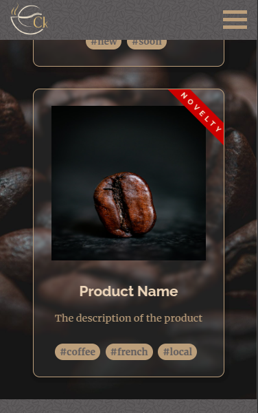
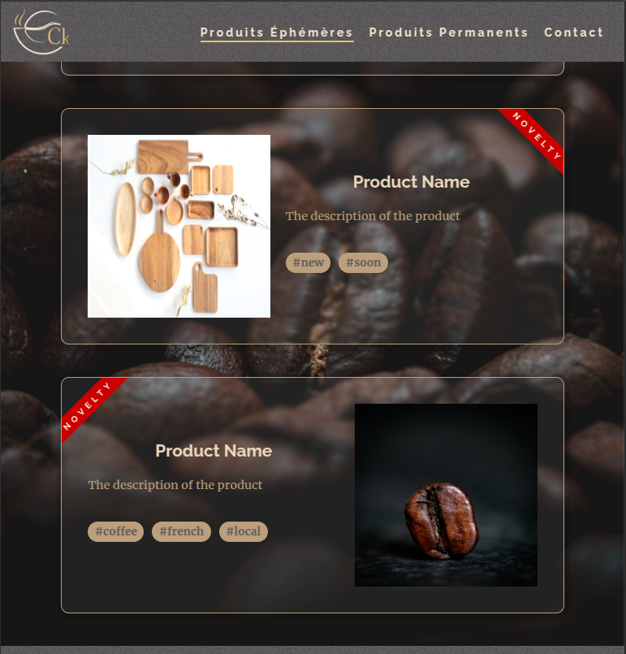
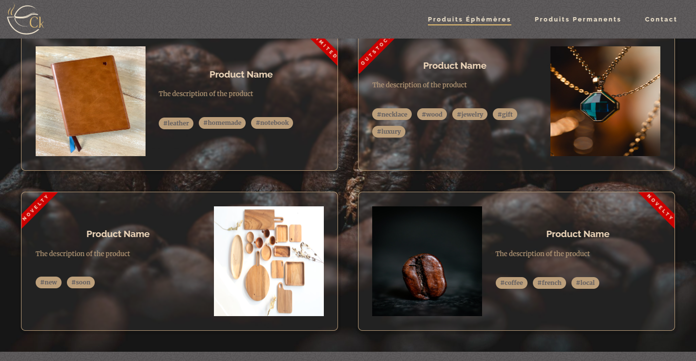

# Curieux KFée's Website

This repository contains the code for the [Curieux KFée](https://curieuxkfee.fr/) website, an online platform designed to showcase the offerings of the coffee-shop located in Salaise-sur-Sanne, France. The website provides an immersive digital experience, allowing visitors to explore the ambiance, products, events, and featured artists of the establishment.

## Table of Contents
- [Curieux KFée's Website](#curieux-kfées-website)
  - [Table of Contents](#table-of-contents)
  - [Introduction](#introduction)
  - [Features](#features)
  - [Pages](#pages)
  - [Technologies Used](#technologies-used)
  - [Installation](#installation)
  - [Usage](#usage)
  - [Screenshots](#screenshots)
    - [Mobile Version](#mobile-version)
    - [Tablet Version](#tablet-version)
    - [Desktop Version](#desktop-version)
  - [Contact](#contact)
  - [Credits](#credits)

## Introduction
Curieux KFée is a fusion of a tea room and a boutique featuring local creators, offering a warm and inviting atmosphere. Visitors can also enjoy handcrafted pastries. This website serves as the digital gateway to the coffee shop, providing insights into its unique concept and the various events it hosts.

## Features
- **Homepage**: A visually engaging introduction featuring a banner, a welcome message from the founder, and highlights of both permanent and ephemeral products. The featured artist of the month is also showcased.
- **Product Pages**: Dedicated pages for permanent and ephemeral products, featuring dynamic randomization and filtering to enhance user navigation.
- **Contact Page**: Provides essential details such as opening hours, address, and an interactive map. Users can contact the coffee shop directly via email or phone through clickable links.

## Pages
1. **Homepage**: Overview of the coffee shop, its founder, core values, and highlighted artists.
2. **Permanent Products**: A detailed display of products consistently available at the shop.
3. **Ephemeral Products**: Showcases limited-time offers and seasonal products.
4. **Contact**: Provides location details, opening hours, and contact options.

## Technologies Used
- HTML
- SCSS
- JavaScript
- PHP
- MySQL
- WordPress
- NPM
- YoastSEO
- Advanced Custom Fields
- Webpack
- Composer

## Installation
1. Ensure that you have Composer, NPM, and Webpack installed on your system.
2. Clone the repository.
3. Navigate to the project directory in your terminal.
4. Run `composer install` to install WordPress, plugins, and themes.
5. Set up your MySQL database.
6. Update the database connection details in the `wp-config.php` file (use a copy of `wp-config-sample.php`).
7. Navigate to the theme directory in your terminal.
8. Run `npm install` to install dependencies.

## Usage
1. Configure the WordPress back-office to dynamically manage content.
2. Customize theme settings and content to align with Curieux KFée’s branding and offerings.
3. **This code is provided as an example of our capabilities and may not be hosted online or used for commercial purposes without the explicit consent of both Curieux KFée and XiaoDev.**

## Screenshots
Here are some previews of the website on different devices:

### Mobile Version

### Tablet Version

### Desktop Version

## Contact
For inquiries regarding this project, please reach out via email:  
📩 contact@xiaodev.fr

## Credits
The Curieux KFée's Website was created and maintained by XiaoDev.

---
If you have any questions or feedback, please [reach out](mailto:&#99;o&#110;&#116;%61%63t&#64;&#120;&#105;a&#111;&#100;%65%76%2e&#102;%72).